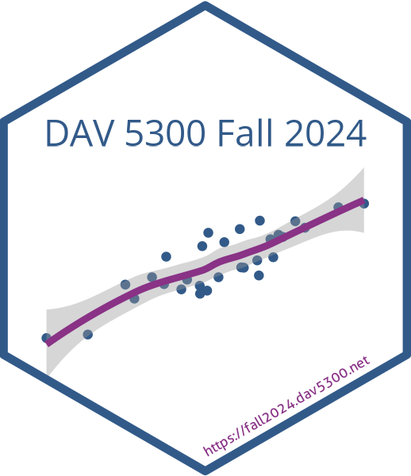

<!-- README.md is generated from README.Rmd. Please edit that file -->

# DAV5300 Spring 2025

Instructors: [Jason Bryer](https://bryer.org)  
Class Meetup: Tuesdays at 5:30pm or 7:45pm  
Office Hours: By appointment  
Contact: <jason.bryer@yu.edu>  
Website: <https://spring2025.dav5300.net>

This course site was adapted from course sites by [Dr. Maria
Tackett](https://github.com/sta210-fa21) and [Dr. Mine
Çetinkaya-Rundel](https://sta210-s22.github.io/website/).

 This
work is licensed under a
<a rel="license" href="http://creativecommons.org/licenses/by-nc/4.0/">Creative
Commons Attribution-NonCommercial 4.0 International License</a>.
