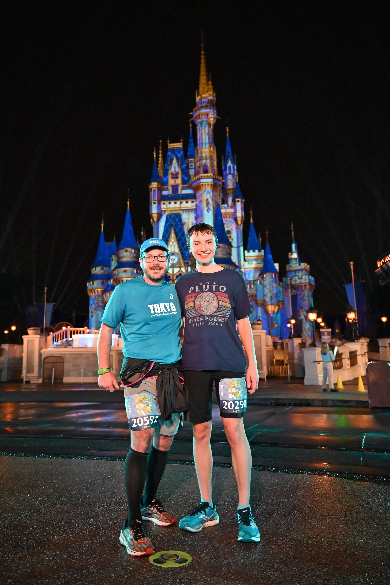

```{r setup, include = FALSE}
# Cartoons from https://github.com/allisonhorst/stats-illustrations
# dplyr based upon https://allisonhorst.shinyapps.io/dplyr-learnr/#section-welcome

source('../config.R')
```

class: center, middle, inverse, title-slide

# `r metadata$title`
## `r metadata$subtitle`
### `r metadata$author`
### `r metadata$date`

---
class: hide-logo, bottom, right, title-slide
background-image: url(images/Greetings_from_Statistics.jpeg)
background-size: contain

.font70[

[@skyetetra](https://twitter.com/ChelseaParlett/status/1340463322118856705)

]

---
# Agenda

.pull-left[
* Introductions

* Syllabus

* Class meetups

* Course Schedule

* Assignments (how you will be graded)

* Software setup

* Brief introduction to R
]
.pull-right[
While waiting, please complete this formative assessment:

```{r, echo=FALSE, fig.width=5, fig.height=5}
qrcode::qr_code(formative_assessment) |> plot(col = c('#FAFAFA', 'black'))
```
]

---
class: font120
# A little about me...

* Earned my Ph.D. in Educational Pschology and Methodology from the University at Albany. Dissertation: [A National Study Comparing Charter and Traditional Public Schools Using Propensity Score Analysis](https://github.com/jbryer/dissertation)
* Assistant Professor at CUNY in Data Science and Information Systems
* Principal Investigator for a Department of Education Grant to develop and test the Diagnostic Assessment and Achievement of College Skills ([www.DAACS.net](http://www.daacs.net))  
* Authored over a dozen R packages including:
	* [likert](http://github.com/jbryer/likert)
	* [sqlutils](http://github.com/jbryer/sqlutils)
	* [timeline](http://github.com/jbryer/timeline)
* Specialize in propensity score methods. Three new methods/R packages developed include:
	* [multilevelPSA](http://github.com/jbryer/multilevelPSA)
	* [TriMatch](http://github.com/jbryer/TriMatch)
	* [PSAboot](http://github.com/jbryer/PSAboot)

---

# Also a Father...

```{r, out.width='65%', fig.align='center', echo=FALSE}
knitr::include_graphics('images/BoysFall2019.jpg')
```

---

# Runner...

<table border='0' width='100%'><tr><td>
<center></center>
</td><td>
<center></center>
</td></tr></table>

---

# And photographer.

```{r, out.width='80%', fig.align='center', echo=FALSE}
knitr::include_graphics('images/Sleeping_Empire.jpg')
```


---

# Syllabus `r hexes(c('blogdown', 'rmarkdown'))`

.pull-left[
Syllabus and course materials are here: `r course_site`

We will use Canvas primary for submitting assignments only. Please submit PDFs.

PDFs are preferred for the homework as there is some LaTeX formatting in the R markdown files. The `tineytex` R package helps with install LaTeX, but you can also install LaTeX using [MiKTeX](http://miktex.org) (for Windows) and [BasicTeX](http://www.tug.org/mactex/morepackages.html) (for Mac).

]
.pull-right[
```{r, echo=FALSE, fig.width=5, fig.height=5}
qrcode::qr_code(course_site) |> plot(col = c('#FAFAFA', 'black'))
```
]

---
class: font90

# Class Meetings

Class will meet every Tuesday. 

In order to get the most out of this class attendance is required.

**One Minute Papers** - Complete the one minute paper after each Meetup (whether you watch live or watch the recordings). It should take approximately one to two minutes to complete. 

---
class: font60
# Schedule

.pull-left[
```{r schedule-setup, echo=FALSE, warning=FALSE, message=FALSE}
# devtools::install_github("gadenbuie/ggweekly")
library(ggweekly)
library(rlang) # Needed for the ggweekly.R script to work
library(configr)
library(ggplot2)
library(readxl)
library(lubridate)
# library(kableExtra)

options(knitr.kable.NA = '')

semester <- 'Fall 2023'

palette <- c('#8dd3c7','#ffffb3','#bebada','#fb8072','#80b1d3','#fdb462',
			 '#b3de69','#fccde5','#d9d9d9','#bc80bd','#ccebc5','#ffed6f')

lastModified <- format(file.info('../Schedule.xlsx')[1,]$mtime, '%B %d, %Y %I:%M%p')

meetups <- read_excel('../Schedule.xlsx', sheet = 'Meetups')
meetups$day <- as.Date(meetups$Date)
meetups$label <- paste0('Meetup ', meetups$StartTime, '\n', meetups$Topic)
# meetups$label <- meetups$Topic
meetups$color <- '#4A235A'
meetups$fill <- NA

schedule <- meetups[,c('day', 'label', 'color', 'fill')]

topics <- read_excel('../Schedule.xlsx', sheet = 'Schedule')
topics$Start <- as.Date(topics$Start)
topics$End <- as.Date(topics$End)
# topics$Topic <- sapply(topics$Topic, markdown::mark) |> unname()
for(i in 1:nrow(topics)) {
	schedule <- rbind(schedule, data.frame(
		day = topics[i,]$Start,
		label = paste0(topics[i,]$Topic, '\n\n\n'),
		color = '#000000',
		fill = palette[i]
	))
	dates <- seq(topics[i,]$Start, topics[i,]$End, by = 'day')[-1]
	for(j in seq_along(dates)) {
		schedule <- rbind(schedule, data.frame(
			day = dates[j],
			label = NA,
			color = NA,
			fill = palette[i]
		))
	}
}

start_day <- lubridate::floor_date(min(meetups$day), "month")
end_day <- lubridate::ceiling_date(max(meetups$day), "month") - 1
```

```{r printTopics, echo=FALSE, warning=FALSE, message=FALSE, results='asis'}
topics$Start <- format(topics$Start, format = '%A, %B %d, %Y')
topics$End <- format(topics$End, format = '%A, %B %d, %Y')
# topics <- topics %>% filter(!is.na(Link)) %>% select(-Link)
knitr::kable(topics[,c('Start','Topic')], format = 'html', escape = FALSE)
```
]
.pull-right[
Assignments are due on Monday before the next class.
]

---
# Textbooks `r hexes(c('openintro'))`


[*OpenIntro Statistics*](https://github.com/jbryer/DATA606Fall2020/blob/master/Textbook/os4.pdf?raw=true) by David Diaz, Mine Çetinkaya-Rundel, and Christopher D Barr.

[*Learning Statistics with R*](https://github.com/jbryer/DATA606Fall2020/blob/master/Textbook/lsr-0.6.pdf?raw=true) by Danielle Navaro - We will only use the Bayesian chapter from this book.

## Optional

[*R for Data Science*](https://r4ds.hadley.nz) by Hadley Wickham and Garrett Grolemund - Recommended reference for those new to R.

---
class: font90
# Assignments

**Labs** (30%) - Labs are designed to provide you an opportunity to apply statistical concepts using statistical software.

**Textbook questions** (15%) - The assigned questions from the textbook provide an opportunity to assess conceptional understandings.

**Participation** (10%) - You are expected to attend every class and to complete a [one minute paper](https://forms.gle/CD5Qxkq3xtdxSheW8) at the conclusion of class.

**Data Project** (25%) - In a group of 2 to 3 students will present the results of analysis using a data set of your choice. More details will be provided a few weeks into the class.

**Final exam** (20%) - A multiple choice exam will be given on the last day of class.

**All assignments are due on Monday.** Assignments submitted late will be penalized. Assignments will not be accepted more than one week after their due date.

---
# Academic Integrity

With the exception of the data project, I expect you to complete all assignments (e.g. homework, labs) on your own. It is fine to ask questions of your peers and professor, but working together and/or sharing answers is not allowed.

## Yeshiva's Policy

The submission by a student of any examination, course assignment, or degree requirement is assumed to guarantee that the thoughts and expressions therein not expressly credited to another are literally the student’s own. Evidence to the contrary will result in appropriate penalties. For more information, visit https://www.yu.edu/academic-integrity.


---
# Communication

* Email: [jason.bryer@yu.edu](mailto:jason.bryer@yu.edu).

* Canvas

* Office hours before and after class and by appointment.

* Slack

---
class: inverse, middle, center
# Software Setup


---
# Why R?

.pull-left[
There are many languages data scientists use. [R](https://r-project.org) is specifically designed for statistics. We will leverage many R packages that are specifically designed to conduct, teach, and communicate statistical analysis.

To be a well rounded data scientists, I believe you need to have experience in both R and Python. For this course:

* Use R for the labs (they are designed to help you learn the core commands). 
* You may use Python or R for the homework and data project.
]
.pull-right[
```{r, echo=FALSE}

```
]

---
# Software `r hexes(c('rmarkdown', 'RStudio', 'tinytex'))`

This is an applied statistics course so we will make extensive use of the [R statistical programming language](https://www.r-project.org).

* Install [R](https://cran.r-project.org) and [RStudio](https://rstudio.com) on your own computer. I encourage everyone to do this at some point by the end of the semester.

You will also need to have [LaTeX](https://www.latex-project.org) installed as well in order to create PDFs. The [`tinytex`](https://yihui.org/tinytex/) R package helps with this process:

```
install.packages('tinytex')
tinytex::install_tinytex()
```

---
class: inverse, middle, center
# Introduction to R


---
# Workflow

.center[

]

.font80[Source: [Wickham & Grolemund, 2017](https://r4ds.had.co.nz)]


---
# Tidy Data

.center[

]

See Wickham (2014) [Tidy data](https://vita.had.co.nz/papers/tidy-data.html).


---
# Types of Data

.pull-left[
* Numerical (quantitative)
	* Continuous
	* Discrete

* Categorical (qualitative)
	* Regular categorical
	* Ordinal
]
.pull-right[
.center[

]
]

---
# Data Types in R

```{r, echo=FALSE, fig.align='center', out.width=1000}
knitr::include_graphics('images/DataTypesConceptModel.png')
```

---
# Data Types / Descriptives / Visualizations


Data Type    |  Descriptive Stats                            | Visualization
-------------|-----------------------------------------------|-------------------|
Continuous   | mean, median, mode, standard deviation, IQR   | histogram, density, box plot
Discrete     | contingency table, proportional table, median | bar plot
Categorical  | contingency table, proportional table         | bar plot
Ordinal      | contingency table, proportional table, median | bar plot
Two quantitative | correlation                               | scatter plot
Two qualitative  | contingency table, chi-squared            | mosaic plot, bar plot
Quantitative & Qualitative | grouped summaries, ANOVA, t-test | box plot

---
# Variance

.pull-left[
Population Variance:
$$ S^2 = \frac{\Sigma (x_i - \bar{x})^2}{N}$$
Consider a dataset with five values (black points in the figure). For the largest value, the deviance is represented by the blue line ( $x_i - \bar{x}$ ).

See also:
https://shiny.rit.albany.edu/stat/visualizess/  
https://github.com/jbryer/VisualStats/

]
.pull-right[

```{r, echo=FALSE, fig.height=12}
x <- c(97.88, 107.91, 88.26, 115.21, 87.38)
variance_vis(x,
			 plot_mean = TRUE,
			 plot_deviances = FALSE,
			 plot_deviances_x = which(x == max(x)),
			 plot_deviances_y = FALSE,
			 plot_sample_variance = FALSE,
			 plot_population_variance = FALSE,
			 plot_population_sd = FALSE)
```
]

---
# Variance (cont.)

.pull-left[
Population Variance:
$$ S^2 = \frac{\Sigma (x_i - \bar{x})^2}{N}$$
In the numerator, we square each of these deviances. We can conceptualize this as a square. Here, we add the deviance in the *y* direction.
]
.pull-right[
```{r, echo=FALSE, fig.height=12}
variance_vis(x,
			 plot_mean = TRUE,
			 plot_deviances = FALSE,
			 plot_deviances_x = which(x == max(x)),
			 plot_deviances_y = which(x == max(x)),
			 plot_sample_variance = FALSE,
			 plot_population_variance = FALSE,
			 plot_population_sd = FALSE)
```
]

---
# Variance (cont.)

.pull-left[
Population Variance:
$$ S^2 = \frac{\Sigma (x_i - \bar{x})^2}{N}$$

We end up with a square.
]
.pull-right[
```{r, echo=FALSE, fig.height=12}
variance_vis(x,
			 plot_mean = TRUE,
			 plot_deviances = which(x == max(x)),
			 plot_deviances_x = which(x == max(x)),
			 plot_deviances_y = which(x == max(x)),
			 plot_sample_variance = FALSE,
			 plot_population_variance = FALSE,
			 plot_population_sd = FALSE)
```
]

---
# Variance (cont.)

.pull-left[
Population Variance:
$$ S^2 = \frac{\Sigma (x_i - \bar{x})^2}{N}$$
We can plot the squared deviance for all the data points. That is, each component in the numerator is the area of each of these squares.
]
.pull-right[
```{r, echo=FALSE, fig.height=12}
variance_vis(x,
			 plot_mean = TRUE,
			 plot_deviances = TRUE,
			 plot_deviances_x = FALSE,
			 plot_deviances_y = FALSE,
			 plot_sample_variance = FALSE,
			 plot_population_variance = FALSE,
			 plot_population_sd = FALSE)
```
]

---
# Variance (cont.)

.pull-left[
Population Variance:
$$ S^2 = \frac{\Sigma (x_i - \bar{x})^2}{N}$$
The variance is therefore the average of the area of all these squares, here represented by the orange square.
]
.pull-right[

```{r, echo=FALSE, fig.height=12}
variance_vis(x,
			 plot_mean = TRUE,
			 plot_deviances = TRUE,
			 plot_deviances_x = FALSE,
			 plot_deviances_y = FALSE,
			 plot_sample_variance = FALSE,
			 plot_population_variance = TRUE,
			 plot_population_sd = FALSE)
```
]

---
# Population versus Sample Variance

.pull-left[
Typically we want the sample variance. The difference is we divide by $n - 1$ to calculate the sample variance. This results in a slightly larger area (variance) then if we divide by $n$.

Population Variance (yellow):
$$ S^2 = \frac{\Sigma (x_i - \bar{x})^2}{N}$$

Sample Variance (green):
$$ s^2 = \frac{\Sigma (x_i - \bar{x})^2}{n-1}$$

]
.pull-right[

```{r, echo=FALSE, fig.height=12}
variance_vis(x,
			 plot_mean = TRUE,
			 plot_deviances = TRUE,
			 plot_deviances_x = FALSE,
			 plot_deviances_y = FALSE,
			 plot_sample_variance = TRUE,
			 plot_population_variance = TRUE,
			 plot_population_sd = FALSE)
```

]

---
# Robust Statistics

Consider the following data randomly selected from the normal distribution:

.pull-left[
```{r, echo=TRUE, fig.height=2}
set.seed(41)
x <- rnorm(30, mean = 100, sd = 15)
mean(x); sd(x)
median(x); IQR(x)
```
]
.pull-right[
```{r, echo=FALSE}
ggplot(data.frame(x = x, y = 0), aes(x = x)) + geom_histogram(bins = 6)
```
]

---
# Robust Statistics

```{r, echo=FALSE, fig.height=2.5}
ggplot() + 
	geom_point(data = data.frame(x = x, y = 0), aes(x = x, y = y), size = 3, alpha = 0.5) +
	geom_segment(aes(y = 0.1, yend = 0.1, x = mean(x) - sd(x), xend = mean(x) + sd(x)), color = 'blue') +
	geom_segment(aes(y = 0.2, yend = 0.2, x = median(x) - IQR(x), xend = median(x) + IQR(x)), color = 'maroon') +
	geom_vline(xintercept = mean(x), linetype = 2, color = 'blue') +
	geom_vline(xintercept = median(x), linetype = 3, color = 'maroon', size = 1.5) +
	geom_text(aes(label = paste0('mean = ', round(mean(x), digits = 2)), x = mean(x) + sd(x), y = 0.1), vjust = -1, color = 'blue') +
	geom_text(aes(label = paste0('median = ', round(median(x), digits = 2)), x = median(x) + sd(x), y = 0.2), vjust = -1, color = 'maroon') +
	geom_text(aes(label = paste0('SD = ', round(sd(x), digits = 2)), x = mean(x) + sd(x), y = 0.1), vjust = 1.5, color = 'blue') +
	geom_text(aes(label = paste0('IQR = ', round(IQR(x), digits = 2)), x = median(x) + sd(x), y = 0.2), vjust = 1.5, color = 'maroon') +
	theme(axis.line.y = element_blank(), axis.text.y = element_blank(),
		  axis.ticks.y = element_blank()) + ylab('') +
	ylim(0, .3) 
```

---
# Robust Statistics

```{r, echo=FALSE, fig.height=2.5}
ggplot() + 
	geom_point(data = data.frame(x = x, y = 0), aes(x = x, y = y), size = 3, alpha = 0.5) +
	geom_segment(aes(y = 0.1, yend = 0.1, x = mean(x) - sd(x), xend = mean(x) + sd(x)), color = 'blue') +
	geom_segment(aes(y = 0.2, yend = 0.2, x = median(x) - IQR(x), xend = median(x) + IQR(x)), color = 'maroon') +
	geom_vline(xintercept = mean(x), linetype = 2, color = 'blue') +
	geom_vline(xintercept = median(x), linetype = 3, color = 'maroon', size = 1.5) +
	geom_text(aes(label = paste0('mean = ', round(mean(x), digits = 2)), x = mean(x) + sd(x), y = 0.1), vjust = -1, color = 'blue') +
	geom_text(aes(label = paste0('median = ', round(median(x), digits = 2)), x = median(x) + sd(x), y = 0.2), vjust = -1, color = 'maroon') +
	geom_text(aes(label = paste0('SD = ', round(sd(x), digits = 2)), x = mean(x) + sd(x), y = 0.1), vjust = 1.5, color = 'blue') +
	geom_text(aes(label = paste0('IQR = ', round(IQR(x), digits = 2)), x = median(x) + sd(x), y = 0.2), vjust = 1.5, color = 'maroon') +
	theme(axis.line.y = element_blank(), axis.text.y = element_blank(),
		  axis.ticks.y = element_blank()) + ylab('') +
	ylim(0, .3) + xlim(-30, 1000)
```

Let's add an extreme value:

```{r}
x <- c(x, 1000)
```

--

```{r, echo=FALSE, fig.height=2.5}
ggplot() + 
	geom_point(data = data.frame(x = x, y = 0), aes(x = x, y = y), size = 3, alpha = 0.5) +
	geom_segment(aes(y = 0.1, yend = 0.1, x = mean(x) - sd(x), xend = mean(x) + sd(x)), color = 'blue') +
	geom_segment(aes(y = 0.2, yend = 0.2, x = median(x) - IQR(x), xend = median(x) + IQR(x)), color = 'maroon') +
	geom_vline(xintercept = mean(x), linetype = 2, color = 'blue') +
	geom_vline(xintercept = median(x), linetype = 3, color = 'maroon', size = 1.5) +
	geom_text(aes(label = paste0('mean = ', round(mean(x), digits = 2)), x = mean(x) + sd(x), y = 0.1), vjust = -1, color = 'blue') +
	geom_text(aes(label = paste0('median = ', round(median(x), digits = 2)), x = median(x) + sd(x), y = 0.2), vjust = -1, color = 'maroon') +
	geom_text(aes(label = paste0('SD = ', round(sd(x), digits = 2)), x = mean(x) + sd(x), y = 0.1), vjust = 1.5, color = 'blue') +
	geom_text(aes(label = paste0('IQR = ', round(IQR(x), digits = 2)), x = median(x) + sd(x), y = 0.2), vjust = 1.5, color = 'maroon') +
	theme(axis.line.y = element_blank(), axis.text.y = element_blank(),
		  axis.ticks.y = element_blank()) + ylab('') +
	ylim(0, .3) + xlim(-30, 1000)
```

---
# Robust Statistics

Median and IQR are more robust to skewness and outliers than mean and SD. Therefore,

* for skewed distributions it is often more helpful to use median and IQR to describe the center and spread

* for symmetric distributions it is often more helpful to use the mean and SD to describe the center and spread


---
class: inverse, right, middle, hide-logo

<!--img src="images/hex/DATA606.png" width="150px"/-->

# Good luck with the semester!

[`r icons::fontawesome("paper-plane")` jason.bryer@yu.edu](mailto:jason.bryer@yu.edu)  
[`r icons::fontawesome("github")` @jbryer](https://github.com/jbryer)  
[`r icons::fontawesome('mastodon')` @jbryer@vis.social](https://vis.social/@jbryer)  
[`r icons::fontawesome("link")` github.com/jbryer/DAV5300-2024-Spring](https://github.com/jbryer/DAV5300-2024-Spring)   


