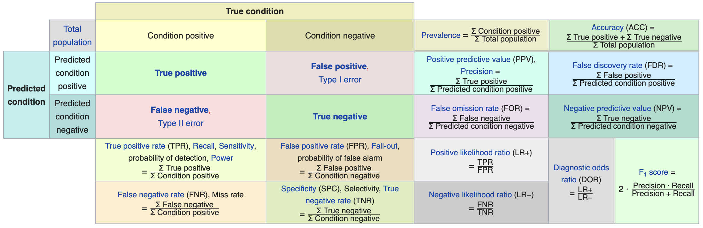

```{r setup, include = FALSE}
# Cartoons from https://github.com/allisonhorst/stats-illustrations
# dplyr based upon https://allisonhorst.shinyapps.io/dplyr-learnr/#section-welcome

source('../config.R')

source('../R/roc.R')

```

class: center, middle, inverse, title-slide

# `r metadata$title`
## `r metadata$subtitle`
### `r metadata$author`
### `r metadata$date`

---
# One Minute Paper Results

```{r omp, echo=FALSE, eval = TRUE}
library(googlesheets4)
omp <- read_sheet(one_minute_paper_results)
omp_date <- format(as.Date(rmarkdown::metadata$date, format = '%B %d, %Y') - 7, format = '%B %d')
omp <- omp %>% dplyr::filter(`Class Date` == omp_date)
```

.pull-left[
**What was the most important thing you learned during this class?**
```{r, echo=FALSE, fig.height=9, eval = TRUE}
ompWordCloud(omp$`What was the most important thing you learned during this class?`)
```
]
.pull-right[
**What important question remains unanswered for you?**
```{r, echo=FALSE, fig.height=9, eval = TRUE}
ompWordCloud(omp$`What important question remains unanswered for you?`)
```
]


---
class: middle, center, inverse
# Bayesian Analysis


---
# Bayesian Analysis


Kruschke's videos are an excelent introduction to Bayesian Analysis [https://www.youtube.com/watch?v=YyohWpjl6KU](https://www.youtube.com/watch?v=YyohWpjl6KU)!

[Doing Bayesian Data Analysis, Second Edition: A Tutorial with R, JAGS, and Stan](http://www.amazon.com/Doing-Bayesian-Data-Analysis-Second/dp/0124058884/ref=sr_1_1?ie=UTF8&qid=1437688316&sr=8-1&keywords=Kruschke)

*The Theory That Would Not Die: How Bayes' Rule Cracked the Enigma Code, Hunted Down Russian Submarines, and Emerged Triumphant from Two Centuries of Controversy* by Sharon Bertsch McGrayne

Video series by Rasmus Baath [Part 1](https://www.youtube.com/watch?v=3OJEae7Qb_o&app=desktop), [Part 2](https://www.youtube.com/watch?v=mAUwjSo5TJE), [Part 3](https://www.youtube.com/watch?v=Ie-6H_r7I5A)

[Billiards with Fred the Frequentist and Bayer the Bayesian](https://towardsdatascience.com/billiards-with-fred-the-frequentist-and-bayer-the-bayesian-bayer-wins-7bc95b24a7ef)

---
# Bayes Theorem


$$ P(A|B)=\frac{P(B|A)P(A)}{P(B|A)P(A)+P(B|{A}^{'})P({A}^{'})} $$


Consider the following data from a cancer test:

* 1% of women have breast cancer (and therefore 99% do not).
* 80% of mammograms detect breast cancer when it is there (and therefore 20% miss it).
* 9.6% of mammograms detect breast cancer when it's not there (and therefore 90.4% correctly return a negative result).

&nbsp;        | Cancer (1%) | No Cancer (99%)
--------------|-------------|-----------------
Test postive  | 80%         |  9.6%
Test negative | 20%         |  90.4%


---
# How accurate is the test?

Now suppose you get a positive test result. What are the chances you have cancer?  
80%? 99%? 1%?

* Ok, we got a positive result. It means we're somewhere in the top row of our table. Let's not assume anything - it could be a true positive or a false positive.
* The chances of a true positive = chance you have cancer * chance test caught it = 1% * 80% = .008
* The chances of a false positive = chance you don't have cancer * chance test caught it anyway = 99% * 9.6% = 0.09504

&nbsp;        | Cancer (1%)       | No Cancer (99%)      |
--------------|-------------------|----------------------|-------------
Test postive  | True +: 1% * 80%  | False +: 99% * 9.6%  | **10.304%**
Test negative | False -: 1% * 20% | True -: 99% * 90.4%  | **89.696%**

---
# How accurate is the test?

$$ Probability = \frac{desired\quad event}{all\quad possibilities} $$

The chance of getting a real, positive result is .008. The chance of getting any type of positive result is the chance of a true positive plus the chance of a false positive (.008 + 0.09504 = .10304).

$$P(C | P) = \frac{P(P|C) P(C)}{P(P)} = \frac{.8 * .01}{.008 + 0.095} \approx .078$$

**So, our chance of cancer is .008/.10304 = 0.0776, or about 7.8%.**


---
# Bayes Formula

It all comes down to the chance of a true positive result divided by the chance of any positive result. We can simplify the equation to:

$$ P\left( A|B \right) =\frac { P\left( B|A \right) P\left( A \right)  }{ P\left( B \right)  }  $$

---
class: middle, center


---
# How many fish are in the lake?

* Catch them all, count them. Not practical (or even possible)!
* We can sample some fish.

Our strategy:

1. Catch some fish.
2. Mark them.
3. Return the fish to the pond. Let them get mixed up (i.e. wait a while).
4. Catch some more fish.
5. Count how many are marked.

For example, we initially caught 20 fish, marked them, returned them to the pond. We then caught another 20 fish and 5 of them were marked (i.e they were caught the first time).

<font size='-1'>
Adopted from Rasmath Bääth useR! 2015 workshop: http://www.sumsar.net/files/academia/user_2015_tutorial_bayesian_data_analysis_short_version.pdf
</font>

---
# Strategy for fitting a model

Step 1: Define Prior Distribution. Draw a lot of random samples from the "prior" probability distribution on the parameters.

```{r, fig.width=8, fig.height=3}
n_draw <- 100000
n_fish <- sample(20:250, n_draw, replace = TRUE)
head(n_fish, n=10)
hist(n_fish, main="Prior Distribution")
```

---
# Strategy for fitting a model

Step 2: Plug in each draw into the generative model which generates "fake" data.

```{r}
pick_fish <- function(n_fish) { # The generative model
	fish <- rep(0:1, c(n_fish - 20, 20))
	sum(sample(fish, 20))
}
n_marked <- rep(NA, n_draw)
for(i in 1:n_draw) {
	n_marked[i] <- pick_fish(n_fish[i])
}
head(n_marked, n=10)
```

---
# Strategy for fitting a model

Step 3: Keep only those parameter values that generated the data that was actually observed (in this case, 5).

```{r, fig.width=8, fig.height=3.5}
post_fish <- n_fish[n_marked == 5]
hist(post_fish, main='Posterior Distribution')
abline(v=median(post_fish), col='red')
abline(v=quantile(post_fish, probs=c(.25, .75)), col='green')
```

---
# What if we have better prior information?

An "expert" believes there are around 200 fish in the pond. Insteand of a uniform distribution, we can use a binomial distribution to define our "prior" distribution.

```{r, fig.width=8, fig.height=3.5}
n_fish <- rnbinom(n_draw, mu = 200 - 20, size = 4) + 20
hist(n_fish, main='Prior Distribution')
```

---
# What if we have better prior information? 

```{r, fig.width=8, fig.height=3.5}
n_marked <- rep(NA, n_draw)
for(i in 1:n_draw) {
	n_marked[i] <- pick_fish(n_fish[i])
}
post_fish <- n_fish[n_marked == 5]
hist(post_fish, main='Posterior Distribution')
abline(v=median(post_fish), col='red')
abline(v=quantile(post_fish, probs=c(.25, .75)), col='green')
```

---
# Bayes Billiards Balls

Consider a pool table of length one. An 8-ball is thrown such that the likelihood of its stopping point is uniform across the entire table (i.e. the table is perfectly level). The location of the 8-ball is recorded, but not known to the observer. Subsequent balls are thrown one at a time and all that is reported is whether the ball stopped to the left or right of the 8-ball. Given only this information, what is the position of the 8-ball? How does the estimate change as more balls are thrown and recorded?

```{r, eval=FALSE}
DATA606::shiny_demo('BayesBilliards', package='DATA606')
```

See also: http://www.bryer.org/post/2016-02-21-bayes_billiards_shiny/


---
class: middle, center, inverse
# Predictive Modeling


---
# Example: Hours Studying Predicting Passing

```{r}
study <- data.frame(
	Hours=c(0.50,0.75,1.00,1.25,1.50,1.75,1.75,2.00,2.25,2.50,2.75,3.00,
			3.25,3.50,4.00,4.25,4.50,4.75,5.00,5.50),
	Pass=c(0,0,0,0,0,0,1,0,1,0,1,0,1,0,1,1,1,1,1,1)
)
study[sample(nrow(study), 5),]
tab <- describeBy(study$Hours, group = study$Pass, mat = TRUE, skew = FALSE)
tab$group1 <- as.integer(as.character(tab$group1))
```


---
# Prediction

Odds (or probability) of passing if studied **zero** hours?

$$log(\frac{p}{1-p}) = -4.078 + 1.505 \times 0$$
$$\frac{p}{1-p} = exp(-4.078) = 0.0169$$
$$p = \frac{0.0169}{1.169} = .016$$

--

Odds (or probability) of passing if studied **4** hours?

$$log(\frac{p}{1-p}) = -4.078 + 1.505 \times 4$$
$$\frac{p}{1-p} = exp(1.942) = 6.97$$
$$p = \frac{6.97}{7.97} = 0.875$$

---
# Fitted Values

```{r}
study[1,]
logistic <- function(x, b0, b1) {
	return(1 / (1 + exp(-1 * (b0 + b1 * x)) ))
}
logistic(.5, b0=-4.078, b1=1.505)
```

---
# Model Performance

The use of statistical models to predict outcomes, typically on new data, is called predictive modeling. Logistic regression is a common statistical procedure used for prediction. We will utilize a **confusion matrix** to evaluate accuracy of the predictions.

```{r, echo=FALSE, out.width=1100}

```

---
class: font80
# Predicting Heart Attacks

Source: https://www.kaggle.com/datasets/imnikhilanand/heart-attack-prediction?select=data.csv

```{r, warning=FALSE}
heart <- read.csv('../course_data/heart_attack_predictions.csv')
heart <- heart |>
	mutate_if(is.character, as.numeric) |>
	select(!c(slope, ca, thal))
str(heart)
```

Note: `num` is the diagnosis of heart disease (angiographic disease status) (i.e. Value 0: < 50% diameter narrowing -- Value 1: > 50% diameter narrowing)


---
# Missing Data

We will save this for another day...

```{r, message = FALSE, warning = FALSE}
complete.cases(heart) |> table()
mice_out <- mice::mice(heart, m = 1)
heart <- mice::complete(mice_out)
```


---
# Data Setup

We will split the data into a training set (70% of observations) and validation set (30%).

```{r}
train.rows <- sample(nrow(heart), nrow(heart) * .7)
heart_train <- heart[train.rows,]
heart_test <- heart[-train.rows,]
```

This is the proportions of survivors and defines what our "guessing" rate is. That is, if we guessed no one had a heart attack, we would be correct 62% of the time.

```{r}
(heart_attack <- table(heart_train$num) %>% prop.table)
```

---
class: font80
# Model Training

```{r}
lr.out <- glm(num ~ ., data=heart_train, family=binomial(link = 'logit'))
summary(lr.out)
```

---
# Predicted Values

```{r}
heart_train$prediction <- predict(lr.out, type = 'response', newdata = heart_train)
ggplot(heart_train, aes(x = prediction, color = num == 1)) + geom_density()
```

---
# Results

```{r}
heart_train$prediction_class <- heart_train$prediction > 0.5
tab <- table(heart_train$prediction_class, 
			 heart_train$num) %>% prop.table() %>% print()
```

For the training set, the overall accuracy is `r round((tab[1,1] + tab[2,2]) * 100, digits = 2)`%. Recall that `r round(heart_attack[1] * 100, digits = 2)`% people did not have a heart attach. Therefore, the simplest model would be to predict that no one had a heart attack, which would mean we would be correct `r round(heart_attack[1] * 100, digits = 2)`% of the time. Therefore, our prediction model is `r  round((tab[1,1] + tab[2,2]) * 100 - heart_attack[1] * 100, digits = 2)`% better than guessing.

---
# Checking with the validation dataset

```{r}
(survived_test <- table(heart_test$num) %>% prop.table())
heart_test$prediction <- predict(lr.out, newdata = heart_test, type = 'response')
heart_test$prediciton_class <- heart_test$prediction > 0.5
tab_test <- table(heart_test$prediciton_class, heart_test$num) %>%
	prop.table() %>% print()
```

The overall accuracy is `r round((tab_test[1,1] + tab_test[2,2]) * 100, digits = 2)`%, or `r round( (tab_test[1,1] + tab_test[2,2] - max(survived_test) ) * 100, digits = 1)`% better than guessing.

---
class: font90
# Receiver Operating Characteristic (ROC) Curve

The ROC curve is created by plotting the true positive rate (TPR; AKA sensitivity) against the false positive rate (FPR; AKA probability of false alarm) at various threshold settings.

.pull-left[
In a classification model, outcomes are either as positive (*p*) or negative (*n*). There are then four possible outcomes:

* **true positive** (TP) The outcome from a prediction is *p* and the actual value is also *p*.
* **false positive** (FP) The actual value is *n*.
* **true negative** (TN) Both the prediction outcome and the actual value are *n*.
* **false negative** (FN) The prediction outcome is *n* while the actual value is *p*.

]
.pull-right[

```{r}
roc <- calculate_roc(heart_train$prediction, 
					 heart_train$num == 1)
summary(roc)
```

]


---
# ROC Curve

.center[

]

---
# ROC Curve

```{r}
plot(roc, curve = 'accuracy')
```

---
# ROC Curve

```{r}
plot(roc)
```


---
class: font90
# Caution on Interpreting Accuracy

- [Loh, Sooo, and Zing](http://cs229.stanford.edu/proj2016/report/LohSooXing-PredictingSexualOrientationBasedOnFacebookStatusUpdates-report.pdf) (2016) predicted sexual orientation based on Facebook Status.

- They reported model accuracies of approximately 90% using SVM, logistic regression and/or random forest methods.

--

- [Gallup](https://news.gallup.com/poll/234863/estimate-lgbt-population-rises.aspx) (2018) poll estimates that 4.5% of the Americal population identifies as LGBT.

--

- *My proposed model:* I predict all Americans are heterosexual.

- The accuracy of my model is 95.5%, or *5.5% better than Facebook's model!*

- Predicting "rare" events (i.e. when the proportion of one of the two outcomes large) is difficult and requires independent (predictor) variables that strongly associated with the dependent (outcome) variable.

---
# Fitted Values Revisited 

What happens when the ratio of true-to-false increases (i.e. want to predict "rare" events)?

Let's simulate a dataset where the ratio of true-to-false is 10-to-1. We can also define the distribution of the dependent variable. Here, there is moderate separation in the distributions.

```{r, echo = FALSE}
library(multilevelPSA)
getSimulatedData <- function(nvars=3,
							 ntreat=100, treat.mean=.6, treat.sd=.5,
							 ncontrol=1000, control.mean=.4, control.sd=.5) {
	if(length(treat.mean) == 1) { treat.mean = rep(treat.mean, nvars) }
	if(length(treat.sd) == 1) { treat.sd = rep(treat.sd, nvars) }
	if(length(control.mean) == 1) { control.mean = rep(control.mean, nvars) }
	if(length(control.sd) == 1) { control.sd = rep(control.sd, nvars) }
	
	df <- c(rep(0, ncontrol), rep(1, ntreat))
	for(i in 1:nvars) {
		df <- cbind(df, c(rnorm(ncontrol, mean=control.mean[i], sd=control.sd[i]),
						  rnorm(ntreat, mean=treat.mean[i], sd=treat.sd[i])))
	}
	df <- as.data.frame(df)
	names(df) <- c('treat', letters[1:nvars])
	return(df)
}
```

```{r message=FALSE, results = 'hide'}
test.df2 <- getSimulatedData(
	treat.mean=.6, control.mean=.4)
```

The `multilevelPSA::psrange` function will sample with varying ratios from 1:10 to 1:1. It takes multiple samples and averages the ranges and distributions of the fitted values from logistic regression.

```{r, results = 'hide'}
psranges2 <- psrange(test.df2, test.df2$treat, treat ~ .,
					 samples=seq(100,1000,by=100), nboot=20)
```

---
# Fitted Values Revisited (cont.)

```{r, fig.height = 7}
plot(psranges2)
```


---
class: left, font140
# One Minute Paper

.pull-left[
1. What was the most important thing you learned during this class?
2. What important question remains unanswered for you?
]
.pull-right[
```{r, echo=FALSE, fig.width=5, fig.height=5}
qrcode::qr_code(one_minute_paper) |> plot(col = c('#FAFAFA', 'black'))
```
]

`r one_minute_paper`
