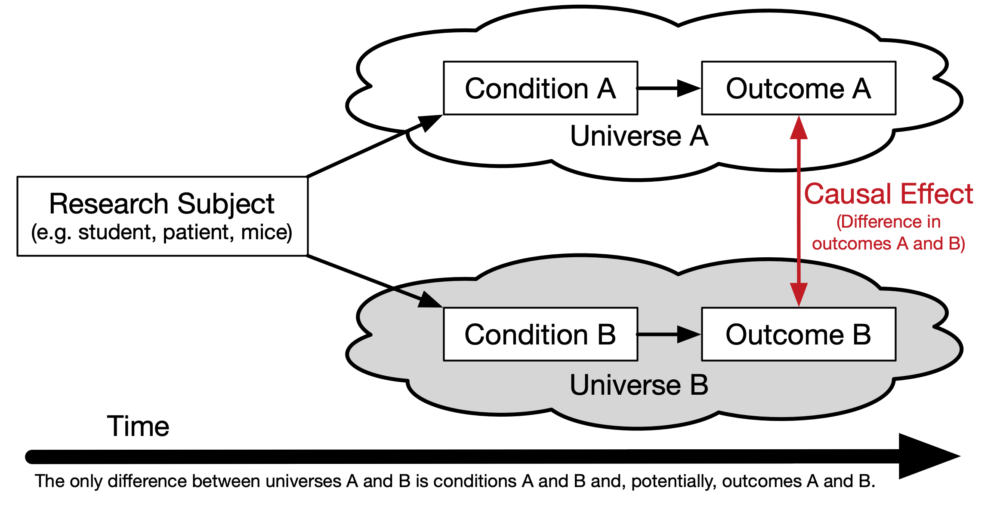
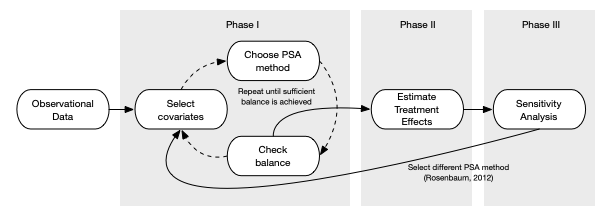

```{r setup, include = FALSE}
# Cartoons from https://github.com/allisonhorst/stats-illustrations
# dplyr based upon https://allisonhorst.shinyapps.io/dplyr-learnr/#section-welcome

source('../config.R')

source('../R/roc.R')

```

class: center, middle, inverse, title-slide

# `r metadata$title`
## `r metadata$subtitle`
### `r metadata$author`
### `r metadata$date`

---
# One Minute Paper Results

```{r omp, echo=FALSE, eval = TRUE}
library(googlesheets4)
omp <- read_sheet(one_minute_paper_results)
omp_date <- format(as.Date(rmarkdown::metadata$date, format = '%B %d, %Y') - 14, format = '%B %d')
omp <- omp %>% dplyr::filter(`Class Date` == omp_date)
```

.pull-left[
**What was the most important thing you learned during this class?**
```{r, echo=FALSE, fig.height=9, eval = TRUE}
ompWordCloud(omp$`What was the most important thing you learned during this class?`)
```
]
.pull-right[
**What important question remains unanswered for you?**
```{r, echo=FALSE, fig.height=9, eval = TRUE}
ompWordCloud(omp$`What important question remains unanswered for you?`)
```
]


---
class: middle, center, inverse
# Bayesian Analysis


---
# Bayesian Analysis


Kruschke's videos are an excelent introduction to Bayesian Analysis [https://www.youtube.com/watch?v=YyohWpjl6KU](https://www.youtube.com/watch?v=YyohWpjl6KU)!

[Doing Bayesian Data Analysis, Second Edition: A Tutorial with R, JAGS, and Stan](http://www.amazon.com/Doing-Bayesian-Data-Analysis-Second/dp/0124058884/ref=sr_1_1?ie=UTF8&qid=1437688316&sr=8-1&keywords=Kruschke)

*The Theory That Would Not Die: How Bayes' Rule Cracked the Enigma Code, Hunted Down Russian Submarines, and Emerged Triumphant from Two Centuries of Controversy* by Sharon Bertsch McGrayne

Video series by Rasmus Baath [Part 1](https://www.youtube.com/watch?v=3OJEae7Qb_o&app=desktop), [Part 2](https://www.youtube.com/watch?v=mAUwjSo5TJE), [Part 3](https://www.youtube.com/watch?v=Ie-6H_r7I5A)

[Billiards with Fred the Frequentist and Bayer the Bayesian](https://towardsdatascience.com/billiards-with-fred-the-frequentist-and-bayer-the-bayesian-bayer-wins-7bc95b24a7ef)

---
# Bayes Theorem


$$ P(A|B)=\frac{P(B|A)P(A)}{P(B|A)P(A)+P(B|{A}^{'})P({A}^{'})} $$


Consider the following data from a cancer test:

* 1% of women have breast cancer (and therefore 99% do not).
* 80% of mammograms detect breast cancer when it is there (and therefore 20% miss it).
* 9.6% of mammograms detect breast cancer when it's not there (and therefore 90.4% correctly return a negative result).

&nbsp;        | Cancer (1%) | No Cancer (99%)
--------------|-------------|-----------------
Test postive  | 80%         |  9.6%
Test negative | 20%         |  90.4%


---
# How accurate is the test?

Now suppose you get a positive test result. What are the chances you have cancer?  
80%? 99%? 1%?

* Ok, we got a positive result. It means we're somewhere in the top row of our table. Let's not assume anything - it could be a true positive or a false positive.
* The chances of a true positive = chance you have cancer * chance test caught it = 1% * 80% = .008
* The chances of a false positive = chance you don't have cancer * chance test caught it anyway = 99% * 9.6% = 0.09504

&nbsp;        | Cancer (1%)       | No Cancer (99%)      |
--------------|-------------------|----------------------|-------------
Test postive  | True +: 1% * 80%  | False +: 99% * 9.6%  | **10.304%**
Test negative | False -: 1% * 20% | True -: 99% * 90.4%  | **89.696%**

---
# How accurate is the test?

$$ Probability = \frac{desired\quad event}{all\quad possibilities} $$

The chance of getting a real, positive result is .008. The chance of getting any type of positive result is the chance of a true positive plus the chance of a false positive (.008 + 0.09504 = .10304).

$$P(C | P) = \frac{P(P|C) P(C)}{P(P)} = \frac{.8 * .01}{.008 + 0.095} \approx .078$$

**So, our chance of cancer is .008/.10304 = 0.0776, or about 7.8%.**


---
# Bayes Formula

It all comes down to the chance of a true positive result divided by the chance of any positive result. We can simplify the equation to:

$$ P\left( A|B \right) =\frac { P\left( B|A \right) P\left( A \right)  }{ P\left( B \right)  }  $$

---
class: middle, center


---
# How many fish are in the lake?

* Catch them all, count them. Not practical (or even possible)!
* We can sample some fish.

Our strategy:

1. Catch some fish.
2. Mark them.
3. Return the fish to the pond. Let them get mixed up (i.e. wait a while).
4. Catch some more fish.
5. Count how many are marked.

For example, we initially caught 20 fish, marked them, returned them to the pond. We then caught another 20 fish and 5 of them were marked (i.e they were caught the first time).

<font size='-1'>
Adopted from Rasmath Bääth useR! 2015 workshop: http://www.sumsar.net/files/academia/user_2015_tutorial_bayesian_data_analysis_short_version.pdf
</font>

---
# Strategy for fitting a model

Step 1: Define Prior Distribution. Draw a lot of random samples from the "prior" probability distribution on the parameters.

```{r, fig.width=8, fig.height=3}
n_draw <- 100000
n_fish <- sample(20:250, n_draw, replace = TRUE)
head(n_fish, n=10)
hist(n_fish, main="Prior Distribution")
```

---
# Strategy for fitting a model

Step 2: Plug in each draw into the generative model which generates "fake" data.

.pull-left[

```{r}
pick_fish <- function(n_fish) { # The generative model
	fish <- rep(0:1, c(n_fish - 20, 20))
	sum(sample(fish, 20))
}
n_marked <- rep(NA, n_draw)
for(i in 1:n_draw) {
	n_marked[i] <- pick_fish(n_fish[i])
}
```

]
.pull-right[

```{r}
cbind(caught_twice = head(n_marked, n=10),
	  pop_est = head(n_fish, n=10)
)
```

]

---
# Strategy for fitting a model

Step 3: Keep only those parameter values that generated the data that was actually observed (in this case, 5).

```{r, fig.width=8, fig.height=3.5}
post_fish <- n_fish[n_marked == 5]
length(post_fish)
hist(post_fish, main='Posterior Distribution')
abline(v=median(post_fish), col='red')
abline(v=quantile(post_fish, probs=c(.25, .75)), col='green')
```

---
# What if we have better prior information?

An "expert" believes there are around 200 fish in the pond. Insteand of a uniform distribution, we can use a binomial distribution to define our "prior" distribution.

```{r, fig.width=8, fig.height=3.5}
n_fish <- rnbinom(n_draw, mu = 200 - 20, size = 4) + 20
hist(n_fish, main='Prior Distribution')
```

---
# What if we have better prior information? 

```{r, fig.width=8, fig.height=3.5}
n_marked <- rep(NA, n_draw)
for(i in 1:n_draw) {
	n_marked[i] <- pick_fish(n_fish[i])
}
post_fish <- n_fish[n_marked == 5]
hist(post_fish, main='Posterior Distribution')
abline(v=median(post_fish), col='red')
abline(v=quantile(post_fish, probs=c(.25, .75)), col='green')
```

---
# Bayes Billiards Balls

Consider a pool table of length one. An 8-ball is thrown such that the likelihood of its stopping point is uniform across the entire table (i.e. the table is perfectly level). The location of the 8-ball is recorded, but not known to the observer. Subsequent balls are thrown one at a time and all that is reported is whether the ball stopped to the left or right of the 8-ball. Given only this information, what is the position of the 8-ball? How does the estimate change as more balls are thrown and recorded?

```{r, eval=FALSE}
DATA606::shiny_demo('BayesBilliards', package='DATA606')
```

See also: http://www.bryer.org/post/2016-02-21-bayes_billiards_shiny/

---
# Bayesian Regression

```{r, echo=FALSE}
library(rstanarm)
study <- data.frame(
	Hours=c(0.50,0.75,1.00,1.25,1.50,1.75,1.75,2.00,2.25,2.50,2.75,3.00,
			3.25,3.50,4.00,4.25,4.50,4.75,5.00,5.50),
	Pass=c(0,0,0,0,0,0,1,0,1,0,1,0,1,0,1,1,1,1,1,1)
)
```

Returning to the `study` example from the logistic regression lecture, we can use the `stan_glm` function from the `rstanarm` R package.

.pull-left[
**Bayesian GLM**

```{r}
stan_out <- rstanarm::stan_glm(
	Pass ~ Hours,
	data = study,
	family = binomial(link = "logit"),
	seed = 2112, 
	refresh = 0)
```

]

.pull-right[
**Frequentist GLM**

```{r}
glm_out <- glm(
	Pass ~ Hours,
	data = study,
	family = binomial(link = 'logit')
)
```

]


---
class: font80
# Bayesian Regression (cont.)

.pull-left[
**Bayesian GLM**

```{r}
summary(stan_out, pars = c("alpha", "beta"))
```

]

.pull-right[

**Frequentist GLM**

```{r}
summary(glm_out)
```

]

---
# Plotting output

.pull-left[
**Bayesian GLM**

```{r}
plot(stan_out, 
	 plotfun = 'areas',
	 prob = 0.68)
```

]
.pull-right[
**Frequentist GLM**

```{r}
jtools::plot_summs(glm_out, 
				   plot.distributions = TRUE, 
				   inner_ci_level = .68, omit.coefs = NULL)
```

]
---
class: middle, center, inverse
# Propensity Score Analysis


```{r setup-psa, results = 'hide', echo=FALSE, message = FALSE, warning = FALSE}
# The following is to fix a DT::datatable issue with Xaringan
# https://github.com/yihui/xaringan/issues/293
options(htmltools.dir.version = FALSE, htmltools.preserve.raw = FALSE)

palette2 <- c('#fc8d62', '#66c2a5')
palette3 <- c('#fc8d62', '#66c2a5', '#8da0cb')
palette3_darker <- c('#d95f02', '#1b9e77', '#7570b3')
palette4 <- c('#1f78b4', '#33a02c', '#a6cee3', '#b2df8a')

library(multilevelPSA)
library(Matching)
library(MatchIt)
library(multilevelPSA)
library(party)
library(PSAgraphics)
library(granovaGG)
library(rbounds)
library(rpart)
library(TriMatch)
library(psa)
library(gridExtra)
library(psych)
library(tidyverse)
library(plyr)

library(knitr)
library(rmarkdown)

theme_set(theme_bw())

data(pisana)
data(tutoring)
```


---
# Popularity of Propensity Score Analysis

```{r popularity, echo=FALSE, fig.width=14, fig.height=8}
data(psa_citations)

ggplot(psa_citations, aes(x = Year, y = Citations, color = Search_Term)) + 
	geom_path() + geom_point() +
	scale_color_brewer('Search Term', palette = 'Set1') +
	ylab('Number of Citations') +
	theme_bw() +
	ggtitle('Number of Citations for Propensity Score Analysis',
			subtitle = 'Source: Web of Science and Google Scholar')
```

---
# Counterfactuals

```{r causalityFig, echo=FALSE}

```

---
# The Randomized Experiment

Considered to be the *gold standard* for estimating causal effects.

* Effects can be estimated using simple means between groups, or blocks in randomized block design.

* Randomization presumes unbiasedness and balance between groups.

However, randomization is often not feasible for many reasons, especially in educational contexts.

The **strong ignorability assumption** states that:

$$({ Y }_{ i }(1),{ Y }_{ i }(0)) \; \unicode{x2AEB} \; { T }_{ i }|{ X }_{ i }=x$$

for all ${X}_{i}$.


---
class: font80
# RCT Example


```{r RCT_Data_Setup}
set.seed(2112)
pop.mean <- 100
pop.sd <- 15
pop.es <- .3
n <- 30
thedata <- data.frame(
	id = 1:30,
	center = rnorm(n, mean = pop.mean, sd = pop.sd),
	stringsAsFactors = FALSE
)
val <- pop.sd * pop.es / 2
thedata$placebo <- thedata$center - val
thedata$treatment <- thedata$center + val
thedata$diff <- thedata$treatment - thedata$placebo
thedata$RCT_Assignment <- sample(c('placebo', 'treatment'), n, replace = TRUE)
thedata$RCT_Value <- as.numeric(apply(thedata, 1, 
					FUN = function(x) { return(x[x['RCT_Assignment']]) }))
head(thedata, n = 3)
tab.out <- describeBy(thedata$RCT_Value, group = thedata$RCT_Assignment, mat = TRUE, skew = FALSE)
```

---
# True Counterfactual

```{r RCT_Simulation, echo=FALSE, fig.width=5}
p1 <- ggplot(thedata) + 
	geom_segment(aes(x = placebo, xend = treatment, y = id, yend = id)) +
	geom_point(aes(x = placebo, y = id), color = 'blue') +
	geom_point(aes(x = treatment, y = id), color = 'red') +
	ylab('') + xlab('Outcome') +
	xlim(pop.mean - 3 * pop.sd, pop.mean + 3 * pop.sd) +
	ggtitle(paste0('True Counterfactual Difference = ', mean(thedata$diff)))
p1b <- p1 +
	geom_vline(xintercept = mean(thedata$treatment), color = 'red') +
	geom_vline(xintercept = mean(thedata$placebo), color = 'blue')
p2 <- ggplot(thedata, aes(x = RCT_Value, color = RCT_Assignment, y = id)) +
	geom_point() +
	scale_color_manual(values = c('placebo' = 'blue', 'treatment' = 'red')) +
	theme(legend.position = 'none') +
	ylab('') + xlab('Outcome') +
	xlim(pop.mean - 3 * pop.sd, pop.mean + 3 * pop.sd) +
	ggtitle('Observed values in an RCT')
p2b <- p2 + 
	geom_vline(data = tab.out, aes(xintercept = mean, color = group1)) +
	ggtitle(paste0('RCT Difference = ', round(diff(tab.out$mean), digits = 2)))
```

.pull-left[
```{r, echo=FALSE, fig.height=12}
p1
```
]

---
# True Counterfactual (left) vs. One RCT (right)

.pull-left[
```{r, echo=FALSE, fig.height=12}
p1
```
]
.pull-right[
```{r, echo=FALSE, fig.height=12}
p2
```
]


---
# True Counterfactual (left) vs. One RCT (right)

.pull-left[
```{r, echo=FALSE, fig.height=12}
p1b
```
]
.pull-right[
```{r, echo=FALSE, fig.height=12}
p2b
```
]

---
# Distribution of Differences from 1,000 RCTs


```{r RCT_distribution, echo=FALSE}
sim.diff <- numeric(1000)
for(i in seq_along(sim.diff)) {
	treats <- sample(c(T,F), n, replace = TRUE)
	sim.diff[i] <- mean(thedata[treats,]$treatment) - mean(thedata[!treats,]$placebo)
}
ggplot(data.frame(x = sim.diff), aes(x = x)) + 
	geom_histogram(alpha = 0.5, bins = 20) +
	geom_vline(xintercept = mean(thedata$diff), color = 'red') +
	geom_vline(xintercept = mean(sim.diff)) +
	xlab('RCT Different') + ylab('Count')
```

---
# Rubin's Causal Model


* The causal effect of a treatment is the difference in an individual's outcome under the situation they were given the treatment and not (referred to as a counterfactual).

$${\delta}_{i} ={ Y }_{ i1 }-{ Y }_{ i0 }$$

* However, it is impossible to directly observe ${\delta}_{i}$ (referred to as *The Fundamental Problem of Causal Inference*, Holland 1986).

* Rubin frames this problem as a "missing data problem" .font70[(see Rubin, 1974, 1977, 1978, 1980, and Holland, 1986)].

<center></center>

---
# Propensity Score Analysis

The propensity score is the "conditional probability of assignment to a particular treatment given a vector of observed covariates" (Rosenbaum & Rubin, 1983, p. 41). The probability of being in the treatment:
$$\pi ({ X }_{ i }) \; \equiv \; Pr({ T }_{ i }=1|{ X }_{ i })$$

The balancing property under exogeneity:

$${ T }_{ i } \; \unicode{x2AEB} { X }_{ i } \;| \; \pi ({ X }_{ i })$$

We can then restate the **ignorability assumption** with the propensity score: 

$$({ Y }_{ i }(1),{ Y }_{ i }(0)) \; \unicode{x2AEB} \; { T }_{ i } \; | \; \pi({ X }_{ i })$$

---
# Treatment Effects

The average treatment effect (ATE) is defined as:

$$E({ r }_{ 1 })-E({ r }_{ 0 })$$

where $E(.)$ is the expectation in the population. For a set of covariates, $X$, and outcomes $Y$ where 0 denotes control and 1 treatment, we define ATE as:

$$ATE=E(Y_{1}-Y_{0}|X)=E(Y_{1}|X)-E(Y_{0}|X)$$

As we will see later there are alternative treatment effects (estimands) we can estimate instead of ATE.

What Rosenbaum and Rubin (1983) proved in their seminal paper is that the propensity score is a univariate representation of the multivariate matrix. As we will see later, two observations with very similar propensity scores will look similar across all the observed covariates.

---
class: inverse, middle, center
# Propensity Score Analysis in Three Phases

---
class: font90
# Simulated Example

We will simulate a dataset with three covariates, `x1` and `x2` which are continuous and `x3` which is categorical. The assumed treatment effect is 1.5.

```{r, echo=FALSE}
cols <- c('#fc8d62', '#66c2a5')
set.seed(2112) 
```

.pull-left[
```{r simulationSetup, cache=TRUE}
n <- 500
treatment_effect <- 1.5
X <- mvtnorm::rmvnorm(
	n,
	mean = c(0.5, 1, 0),
	sigma = matrix(c(2, 1, 1,
					 1, 1, 1,
					 1, 1, 1), 
					 ncol = 3) )
dat <- tibble(
	x1 = X[, 1],
	x2 = X[, 2],
	x3 = X[, 3] > 0,
	treatment = as.numeric(- 0.5 +
						   	0.25 * x1 + 
						   	0.75 * x2 + 
						   	0.05 * x3 + 
						   	rnorm(n, 0, 1) > 0),
	outcome = treatment_effect * treatment + 
		rnorm(n, 0, 1)
)
```
]
.pull-right[
```{r}
head(dat, n = 6)
```
]

---
# Scatterplot

```{r}
ggplot(dat, aes(x = x1, y = x2, shape = x3, color = factor(treatment))) + 
	geom_point() + scale_color_manual('Treatment', values = cols)
```


---
# Steps for Implementing Propensity Score Analysis

```{r, echo=FALSE, out.width = '90%'}

```

---
# Propensity score methods

There are three major approaches for conducting PSA:

* **Stratification** Treatment and comparison units are divided into strata (or subclasses) so that treated and comparison units are similar within each strata. Cochran (1968) observed that creating five subclassifications (stratum) removes at least 90% of the bias in the estimated treatment effect.

* **Matching** - Each treatment unit is paired with a comparison unit based upon the pre-treatment covariates.

* **Weighting** Each observation is weighted by the inverse of the probability of being in that group.


---
# Stratification

Stratification involves dividing (or stratifying) the observations into subgroups based upon the propensity score. Here, we used quintiles on the propensity scores where were estimated using logistic regression. For classification trees the stratum is determined by the leaf nodes.

```{r, echo=FALSE}
lr.out <- glm(treatment ~ x1 + x2 + x3, data = dat, family = binomial(link='logit'))
dat$ps <- fitted(lr.out) # Get the propensity scores

# Stratification
breaks5 <- psa::get_strata_breaks(dat$ps)
dat$strata5 <- cut(x = dat$ps, 
				   breaks = breaks5$breaks, 
				   include.lowest = TRUE, 
				   labels = breaks5$labels$strata)
```

```{r, echo=FALSE}
ggplot(dat, aes(x = ps, color = as.logical(treatment))) + 
	geom_density(aes(fill = as.logical(treatment)), alpha = 0.2) +
	geom_vline(xintercept = breaks5$breaks, alpha = 0.5) +
	geom_text(data = breaks5$labels, 
			  aes(x = xmid, y = 0, label = strata),
			  color = 'black', vjust = 0.8, size = 8) +
	scale_fill_manual('Treatment', values = palette2) +
	scale_color_manual('Treatment', values = palette2) +
	xlab('Propensity Score') + ylab('Density') +
	xlim(c(0, 1)) +
	ggtitle('Density distribution of propensity scores by treatment',
			subtitle = 'Five strata represented by vertical lines')
```


---
# Stratification (cont.)

Independent sample tests (e.g. *t*-tests) are conducted within each stratum and pooled to provide an overall estimate.

```{r, echo=FALSE}
psa::stratification_plot(ps = dat$ps,
						 treatment = dat$treatment,
						 outcome = dat$outcome)
```


---
# Matching

Dependent sample tests (e.g. *t*-tests) are conducted using match pairs to provide a treatment.

```{r, echo=FALSE}
match_out <- Matching::Match(Y = dat$outcome,
							 Tr = dat$treatment,
							 X = dat$ps,
							 caliper = 0.1,
							 estimand = 'ATE')
dat_match <- data.frame(treat_ps = dat[match_out$index.treated,]$ps,
						treat_outcome = dat[match_out$index.treated,]$outcome,
						control_ps = dat[match_out$index.control,]$ps,
						control_outcome = dat[match_out$index.control,]$outcome)
psa::matching_plot(ps = dat$ps,
				   treatment = dat$treatment,
				   outcome = dat$outcome,
				   index_treated = match_out$index.treated,
				   index_control = match_out$index.control)
```

---
# Matching Methods

There are many choices and approaches to matching, including:

* Propensity score matching.
* Limited exact matching.
* Full matching.
* Nearest neighbor matching.
* Optimal/Genetic matching.
* Mahalanobis distance matching (for quantitative covariates only).
* Matching with and without replacement.
* One-to-one or one-to-many matching.

**Which method should you use?**

*Whichever one gives the best balance!*

---
# Weighting

Propensity score weights can be used as regression weights, the specific weights depend on the desired estimand and will be provided in later slides.


```{r, echo=FALSE}
dat <- dat |> mutate(
	ate_weight = psa::calculate_ps_weights(treatment, ps, estimand = 'ATE'),
	att_weight = psa::calculate_ps_weights(treatment, ps, estimand = 'ATT'),
	atc_weight = psa::calculate_ps_weights(treatment, ps, estimand = 'ATC'),
	atm_weight = psa::calculate_ps_weights(treatment, ps, estimand = 'ATM')
)
psa::weighting_plot(ps = dat$ps,
					treatment = dat$treatment,
					outcome = dat$outcome)
```

---
# Shiny Application

We can explore how these three plots change as the treatment effects change using the `psa::psa_simulation_shiny()` application.


```{r, eval=FALSE}
psa::psa_simulation_shiny()
```

```{r, echo=FALSE, out.width='50%'}
knitr::include_graphics('images/psa_simulation_screenshot.png')
```


---
# Phase I: Estimate Propensity Scores

.pull-left[
In this example we will use logistic regression to estimate the propensity scores.

```{r}
lr.out <- glm(
	treatment ~ x1 + x2 + x3, 
	data = dat,	
	family = binomial(link='logit'))
dat$ps <- fitted(lr.out) # Propensity scores
```

For stratification we will use quintiles to split the observations into five equal groups.

```{r}
breaks5 <- psa::get_strata_breaks(dat$ps)
dat$strata5 <- cut(
	x = dat$ps, 
	breaks = breaks5$breaks, 
	include.lowest = TRUE, 
	labels = breaks5$labels$strata)
```

]
.pull-right[.font70[
```{r}
summary(lr.out)
```
]]

---
# Distribution of Propensity Scores

```{r}
ggplot(dat) +
	geom_histogram(data = dat[dat$treatment == 1,], aes(x = ps, y = after_stat(count)), bins = 50, fill = cols[2]) +
	geom_histogram(data = dat[dat$treatment == 0,], aes(x = ps, y = -after_stat(count)), bins = 50, fill = cols[1]) +
	geom_hline(yintercept = 0, lwd = 0.5) +	scale_y_continuous(label = abs) 
```


---
# Check Balance: Multiple Covariates

```{r}
PSAgraphics::cv.bal.psa(dat[,1:3], dat$treatment, dat$ps, strata = 5)
```

---
# Check Balance: Single Covariate

.pull-left[
```{r, fig.height=8}
PSAgraphics::box.psa(dat$x1, 
					 dat$treatment, 
					 dat$strata5)
```
]
.pull-right[
```{r, results='hide', fig.height=8}
PSAgraphics::cat.psa(dat$x3,
					 dat$treatment,
					 dat$strata5)
```
]


---
# Average Treatment Effect (ATE)

$$ATE = E(Y_1 - Y_0 | X) = E(Y_1|X) - E(Y_0|X)$$

```{r, echo = FALSE}
ggplot() +
	geom_histogram(data = dat[dat$treatment == 1,],
				   aes(x = ps, y = after_stat(count)),
				   bins = 50, alpha = 0.5) +
	geom_histogram(data = dat[dat$treatment == 1,],
				   aes(x = ps, weight = ate_weight, y = after_stat(count)),
				   bins = 50, 
				   fill = cols[2], alpha = 0.5) +
	geom_histogram(data = dat[dat$treatment == 0,],
				   aes(x = ps, y = -after_stat(count)),
				   bins = 50, alpha = 0.5) +
	geom_histogram(data = dat[dat$treatment == 0,],
				   aes(x = ps, weight = ate_weight, y = -after_stat(count)),
				   bins = 50, 
				   fill = cols[1], alpha = 0.5) +
	ggtitle('Average Treatment Effect (ATE)')
```


---
# Treatment Effects for Weighting

$$Treatment\ Effect = \frac{\sum Y_{i}Z_{i}w_{i}}{\sum Z_{i} w_{i}} - \frac{\sum Y_{i}(1 - Z_{i}) w_{i}}{\sum (1 - Z_{i}) w_{i} }$$

Where $w$ is the weight (as defined in the following sections), $Z_i$ is the treatment assignment such that $Z = 1$ is treatment and $Z = 0$ is control, and $Y_i$ is the outcome


.pull-left[
$$w_{ATE} = \frac{Z_i}{\pi_i} + \frac{1 - Z_i}{1 - \pi_i}$$
$$w_{ATT} = \frac{\pi_i Z_i}{\pi_i} + \frac{\pi_i (1 - Z_i)}{1 - \pi_i}$$
]
.pull-right[
$$w_{ATC} = \frac{(1 - \pi_i) Z_i}{\pi_i} + \frac{(1 - e_i)(1 - Z_i)}{1 - \pi_i}$$
$$w_{ATM} = \frac{min\{\pi_i, 1 - \pi_i\}}{Z_i \pi_i (1 - Z_i)(1 - \pi_i)}$$
]


---
class: font90
# Treatment Effects

.font80[**Average Treatment Effect**]
```{r}
psa::treatment_effect(
	treatment = dat$treatment, 
	outcome = dat$outcome, 
	weights = dat$ate_weight)
```

```{r}
lm(outcome ~ treatment, 
   data = dat, 
   weights = dat$ate_weight)
```


---
class: inverse, middle, center
# Example: National Supported Work Demonstration


---
# National Supported Work

The National Supported Work (NSW) Demonstration was a federally and privately funded randomized experiment done in the 1970s to estimate the effects of a job training program for disadvantaged workers.


* Participants were randomly selected to participate in the training program.
* Both groups were followed up to determine the effect of the training on wages.
* Analysis of the mean differences (unbiased given randomization), was approximately $800.


Lalonde (1986) used data from the Panel Survey of Income Dynamics (PSID) and the Current Population Survey (CPS) to investigate whether non-experimental methods would result in similar results to the randomized experiment. He found results ranging from $700 to $16,000.


---
# National Supported Work (cont.)

Dehejia and Wahba (1999) later used propensity score matching to analyze the data. The found that,

* Comparison groups selected by Lalonde were very dissimilar to the treated group.
* By restricting the comparison group to those that were similar to the treated group, they could replicate the original NSW results.
* Using the CPS data, the range of treatment effect was between $1,559 to $1,681. The experimental results for the sample sample was approximately $1,800.

The covariates available include: age, education level, high school degree, marital status, race, ethnicity, and earning sin 1974 and 1975.

Outcome of interest is earnings in 1978.

```{r echo=TRUE,results='hide'}
data(lalonde, package='Matching')
```


---
class: font90
# Estimating Propensity Scores

.pull-left[
Estimate propensity scores using logistic regression.

```{r}
lalonde.formu <- treat ~ age + educ + black + hisp +
	married + nodegr + re74 + re75
glm1 <- glm(lalonde.formu, 
			data = lalonde,
			family = binomial(link = 'logit'))
```

Get the propensity scores:

```{r}
lalonde$ps <- fitted(glm1)
```

Define the stratification: 

```{r}
strata5 <- cut(lalonde$ps, 
			   quantile(lalonde$ps, seq(0, 1, 1/5)), 
			   include.lowest = TRUE, 
			   labels = letters[1:5])
```
]
.pull-right[
.font70[
```{r}
summary(glm1)
```
]
]

---
# Checking Balance: Covariate Balance Plot

```{r cvbalpsa, echo=TRUE, results='hide'}
covars <- all.vars(lalonde.formu)
covars <- lalonde[,covars[2:length(covars)]]
cv.bal.psa(covars, lalonde$treat, lalonde$ps, strata = 5)
```

---
# Checking Balance: Continuous Covariates

.pull-left[
```{r, echo=TRUE, fig.width = 7, fig.height = 6}
box.psa(lalonde$age, lalonde$treat, strata5)
```
]
.pull-right[
```{r, echo=TRUE, fig.width = 7, fig.height = 6}
box.psa(lalonde$re74, lalonde$treat, strata5)
```
]


---
# Checking Balance: Continuous Covariates (cont.)

.pull-left[
```{r, echo=TRUE, fig.width = 7, fig.height = 6}
box.psa(lalonde$educ, lalonde$treat, strata5)
```

]
.pull-right[
```{r, echo=TRUE, fig.width = 7, fig.height = 6}
box.psa(lalonde$re75, lalonde$treat, strata5)
```
]

---
# Checking Balance: Categorical Covariates

.pull-left[
```{r, echo=TRUE, fig.width = 7, fig.height = 6, results='hide'}
cat.psa(lalonde$married, lalonde$treat, strata5)
```
]
.pull-right[
```{r, echo=TRUE, fig.width = 7, fig.height = 6, results='hide'}
cat.psa(lalonde$hisp, lalonde$treat, strata5)
```
]

---
# Checking Balance: Categorical Covariates (cont.)

.pull-left[
```{r, echo=TRUE, fig.width = 7, fig.height = 6, results='hide'}
cat.psa(lalonde$black, lalonde$treat, strata5)
```
]
.pull-right[
```{r, echo=TRUE, fig.width = 7, fig.height = 6, results='hide'}
cat.psa(lalonde$nodegr, lalonde$treat, strata5)
```
]

---
# Loess Regression

```{r loessplot, fig.width=14, fig.height=7.5, echo=FALSE, results='hide'}
psadf <- data.frame(ps = lalonde$ps, Y = lalonde$re78, Tr = lalonde$treat)
loess_plot(ps = psadf[psadf$Y < 30000,]$ps, 
		   outcome = psadf[psadf$Y < 30000,]$Y, 
		   treatment = as.logical(psadf[psadf$Y < 30000,]$Tr))
```

---
# Stratification

.pull-left[
```{r}
psa::stratification_plot(ps = psadf$ps,
						 treatment = psadf$Tr,
						 outcome = psadf$Y,
						 n_strata = 5)
```
]
.pull-right[
```{r}
psa::stratification_plot(ps = psadf$ps,
						 treatment = psadf$Tr,
						 outcome = psadf$Y,
						 n_strata = 10)
```
]

---
# Stratification (cont.)

.pull-left[
```{r circpsa5,fig=TRUE, fig.width=7, fig.height=5, results='hide'}
strata5 <- cut(lalonde$ps, 
			   quantile(lalonde$ps, seq(0, 1, 1/5)), 
			   include.lowest = TRUE, 
			   labels = letters[1:5])
circ.psa(lalonde$re78, lalonde$treat, strata5)
```
]

.pull-right[
```{r circpsa10,fig=TRUE, fig.width=7, fig.height=5,results='hide'}
strata10 <- cut(lalonde$ps, 
				quantile(lalonde$ps, seq(0, 1, 1/10)), 
				include.lowest = TRUE,
				labels = letters[1:10])
circ.psa(lalonde$re78, lalonde$treat, strata10)
```
]

---
class: font60
# Stratification (cont.)

.pull-left[
```{r, echo=FALSE, fig.show='hide'}
circ.psa(lalonde$re78, lalonde$treat, strata5)
```
]

.pull-right[
```{r, echo=FALSE, fig.show='hide'}
circ.psa(lalonde$re78, lalonde$treat, strata10)
```
]


---
# Matching

```{r }
rr <- Match(Y = lalonde$re78, 
			Tr = lalonde$treat, 
			X = lalonde$ps, 
			M = 1,
			estimand = 'ATT',
			ties = FALSE)
summary(rr)
```


---
# Visualizing Matching Results

```{r granovaggds, echo=TRUE, results='hide'}
matches <- data.frame(Treat = lalonde[rr$index.treated,'re78'],
					  Control = lalonde[rr$index.control,'re78'])
granovagg.ds(matches[,c('Control','Treat')], xlab = 'Treat', ylab = 'Control')
```


---
# Balance for Matching


```{r}
psa::MatchBalance(df = lalonde, formu = lalonde.formu,
				  formu.Y = update.formula(lalonde.formu, re78 ~ .),
				  M = 1, estimand = 'ATT', ties = FALSE) |> plot()
```


---
# Balance for Matching (cont.)

```{r}
psa::MatchBalance(df = lalonde, formu = lalonde.formu,
				  formu.Y = update.formula(lalonde.formu, re78 ~ .),
				  exact.covs = c('nodegr'), #<<
				  M = 1, estimand = 'ATT', ties = FALSE) |> plot()
```

---
# Additional Resources

* Propensity Score R Package and Book: [psa.bryer.org](https://psa.bryer.org)

* PSA talk for the NYC R Meetup Group: [bryer.org/posts/2023-11-14-Intro_to_PSA.html](https://bryer.org/posts/2023-11-14-Intro_to_PSA.html)

* R Packages
	* `PSAgraphics` - https://github.com/jbryer/PSAgraphics
	* `multilevelPSA` - https://github.com/jbryer/multilevelPSA
	* `TriMatch` - https://jbryer.github.io/TriMatch
	* `PSAboot` - https://github.com/jbryer/PSAboot

---
class: left, font140
# One Minute Paper

.pull-left[
1. What was the most important thing you learned during this class?
2. What important question remains unanswered for you?
]
.pull-right[
```{r, echo=FALSE, fig.width=5, fig.height=5}
qrcode::qr_code(one_minute_paper) |> plot(col = c('#FAFAFA', 'black'))
```
]

`r one_minute_paper`
